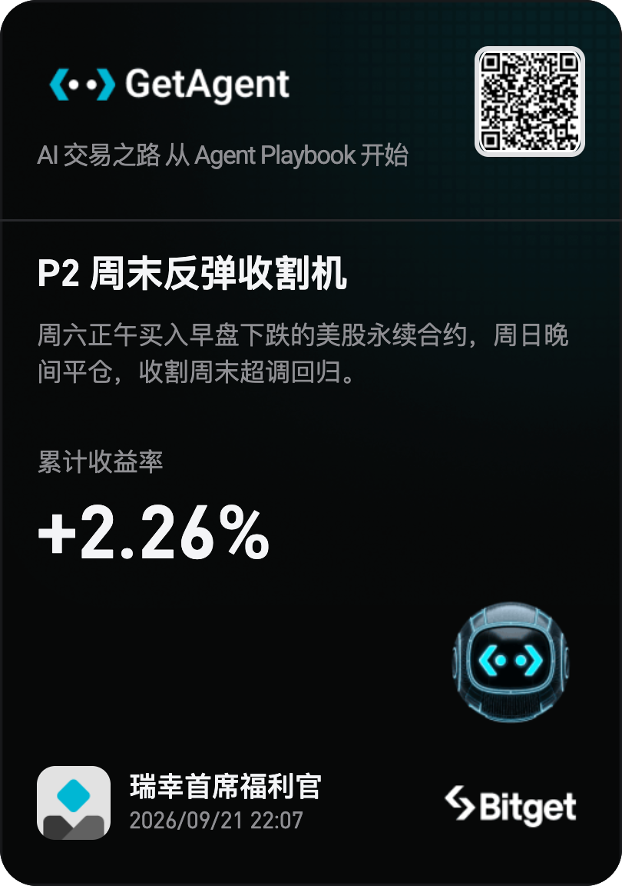

# P2 Weekend Bounce Harvester

> Bitget AI Base Camp Hackathon S2 · Track 1 Alpha Factory · 子主题：rToken 因子策略（休市窗口均值回归）
> Bitget 官方生态：GetAgent Playbook（已发布 v0.2.2）+ bitget-mcp-server 数据层 + bitget-signal 感知层

回测展示页面（可复现）：[GitHub Pages](https://slumhee.github.io/bitget-hackathon-s2-p2-weekend-bounce/)

当美股闭市、定价权交给 crypto 交易者时，周六早盘的下跌是"无信息超调"。
本策略在周六正午买入早盘下跌的 Stock Perpetual、周日晚间平仓，收割超调回归。

**一句话：不是预测方向，是交易市场微观结构的时间性错位。**

## 🎮 在线体验（Live Demo）

- **GetAgent Studio 策略页**：<https://getagent.studio/strategy/ae67bdd5-421e-452e-889a-2ea11dea5d8f>
  Paper Trading 已开启，每个周六 12:00 UTC 自动运行并留运行日志（比赛要求的 paper 证据）
- **Bitget Playbook 市场卡片**：<https://www.bitget.com/zh-CN/activity/ai-get-agent/playbook?clacCode=S1UPL1EU>
  （进入后于「我创建的」/ 合约策略分区查看 "P2 Weekend Bounce Harvester"）
- **回测报告（GitHub Pages）**：<https://slumhee.github.io/bitget-hackathon-s2-p2-weekend-bounce/>



*Studio 分享卡：累计收益率 +2.26%（沙箱回测），Paper Trading 运行中。*

## 成绩速览

**双引擎验证，指标互相印证：**

| 指标 | GetAgent 沙箱回测（1h bar · 94d · v0.2.2） | 本地冻结回测（1m bar · 60D IS + 34D OOS） |
|---|---|---|
| 总收益 | +2.27% | OOS 34 天复利 +2.87% |
| Sharpe（年化） | 3.50 | 3.12 IS / 6.2 OOS |
| Sortino（年化） | 32.31 | — |
| 最大回撤 | -0.43% | -0.46% IS / -0.17% OOS |
| 胜率（周末级） | 75.6%（持仓级） | 66.7% IS / 80% OOS（周末级 4/5） |
| 交易次数 | 178 fills / 46+ round trips | 51 trades（IS 33 + OOS 18） |
| 换手率 | — | 平均每周末 0.8x 双边名义（3.6/9 名字触发，持有 ~33h） |
| 滚动 30d Sharpe | — | 末段稳定 6.6-10.2（IS 早期 warm-up 窗口为负） |

- 蒙特卡洛 2000 次：bootstrap P(负)=0；随机场 placebo 位于 99.7 分位
- OOS 含 2026-09-19/20 首个亏损周末（-16.1bp，HOOD 拖累），如实入账；该周末信号由 paper trader 提前生成、回测入场价与实时日志逐笔一致
- 成本压力 4→18bp RT 全档为正；break-even ≈ 87bp（现实成本的 7 倍）
- BTC beta 0.48，残差 alpha +57.7bp/周末——一半 crypto beta、一半纯股票永续 alpha
- 沙箱按真实费率计费（maker 2bp / taker 6bp），funding 在本地回测逐笔计入

## 目录结构

```
p2-weekend-bounce/
├── index.html              ← 回测报告（GitHub Pages 入口，直接打开）
├── README.md               ← 本文件
├── build_html.py           ← 报告生成脚本
├── report_template.html    ← 报告模板
├── playbook/               ← Bitget 官方 GetAgent Playbook 包（已发布 v0.2.4）
│   └── p2-weekend-bounce/
│       ├── manifest.yaml   ← 双语 manifest（trade_strategy / follow_trade）
│       ├── backtest.yaml   ← 9 instrument · 真实费率 · Nautilus 回放规格
│       └── src/            ← Nautilus 策略 + getagent SDK 入口（沙箱回测同款代码）
├── live/                   ← Bitget 生态实时接入层
│   ├── bitget_market.py    ← 公共行情客户端（无 key，增量缓存）
│   ├── weekend_signal.py   ← 实时信号引擎（与回测因果逻辑一致）
│   ├── paper_trader.py     ← shadow/模拟盘双模式 paper trader（JSONL 日志）
│   ├── mcp_data.py         ← bitget-mcp-server 官方数据层（美股/ETF）
│   ├── weekend_premium.py  ← 周末溢价追踪（perp vs 原生收盘，MCP 数据）
│   ├── bitget_signal.py    ← bitget-signal 感知层（BTC 环境，跨 crypto 因子）
│   ├── data/               ← Playbook 沙箱结果、周末溢价 CSV 等
│   └── logs/               ← paper trading JSONL 日志（gitignored）
├── data/                   ← 全部回测结果数据（CSV/JSON）
├── reproduce/              ← 本地复现入口（bash run_all.sh，5-10 分钟）
└── tech/                   ← 技术层：架构 / 成本压力 / LOO 稳健性报告
```

## 比赛合规（Bitget AI Base Camp Hackathon S2）

| 要求 | 状态 | 说明 |
|---|---|---|
| 赛道 | ✅ Alpha Factory（量化策略） | 子主题：rToken 因子策略（休市窗口均值回归） |
| 回测记录 | ✅ 总期 94 天（2026-06-19→09-20），样本外 34 天（08-18→09-20） | 满足 ≥60d / ≥30d 要求 |
| 策略代码 | ✅ `playbook/p2-weekend-bounce/` + 仓库全部脚本 | GitHub 公开可访问 |
| 大模型作用 | ✅ 策略开发辅助（代码生成、参数探索、文档撰写） | 模型：Claude + Qwen（开发环境），非运行时依赖 |
| X 传播帖 | ⚠️ 待发布 | 须含 `#BitgetHackathon` + `@Bitget_AI` + 转发官方帖 |
| Paper Trading | ✅ Studio 已启动，每周六 12:00 UTC 自动运行 | 持续累积赛期 paper 证据 |
| 目标用户 | Retail 散户，资金 ≤$50k，低频（每周 1-2 次），美股合约市场，偏好被动持有 weekend 窗口而非日内盯盘 | 非「所有 trader」 |

**诚实披露：** 样本外 Sharpe 6.2 > IS Sharpe 3.12（OS/IS = 1.98，无衰减预警）。首亏周末 09-19–20 -16.1bp 如实记录。全部指标为仓库引擎实测值（`data/oos_results.json`），非平台截图。

## 快速复现

```bash
cd reproduce
bash run_all.sh        # 约 5-10 分钟，即可重新生成全部结果
```

依赖：Python 3.10+，pandas，numpy。无需 API key（原始数据已随包附带）。

Playbook 沙箱回测结果存于 `live/data/playbook_run_result.json`（run `pbrun-427ab7ec40d8` / `pbrun-0973888d8d5e`，两次结果逐位一致）。

## 策略规则（冻结 v1.0）

1. **Universe**：9 个 Stock Perpetual（IS 内选出）：SPY META NFLX AAPL HOOD COIN TSLA QQQ RDDT
2. **入场**：周六 00:00→12:00 UTC 收盘收益 < 0 → 12:01 bar open 市价买入
3. **权重**：篮内等权 1/N，组合总敞口 1x
4. **出场**：周日 21:00 bar → 21:01 open 全平；同周末不再入场
5. **成本**：taker 12bp RT；funding 按真实历史事件逐笔计入

## Bitget 生态三层接入（S2 比赛工具箱对齐）

| 层 | 官方工具 | 本仓库落点 | 状态 |
|---|---|---|---|
| 主路径 | GetAgent Skill + Playbook + Studio | `playbook/` → 已发布 v0.2.4，Paper Trading 已开 | ✅ 运行中 |
| 数据层 | bitget-mcp-server（美股/ETF 行情与基本面） | `live/mcp_data.py` + `live/data/weekend_premium.csv` | ✅ 实测打通 |
| 感知层 | bitget-signal（跨 crypto 宏观/情绪/技术面） | `live/bitget_signal.py`，接入 paper trader 盯市 | ✅ 实测打通 |

首个生态数据成果：9 标的中 7 个周六正午相对原生周五收盘溢价（RDDT +67.6bp、META +65.0bp、COIN +41.2bp）——周末 perp 定价并非噪音，是策略"回归原生锚"假设的官方数据锚定。

## 合规声明

- 交易腿 100% Bitget Stock Perpetual；BTC 仅作对照/回归，不进组合
- 信号→执行严格 next-bar，无同 bar 泄漏；无未来函数
- 品种选择、K 值、全部参数在 60D IS 内冻结；30D OOS 只读配置
- 统计单位 = 周末组合收益（同周末资产高度相关，不虚增样本）
- 沙箱回测未建模 funding（本地回测已计入），属已知保守偏差项，已在风险段披露
